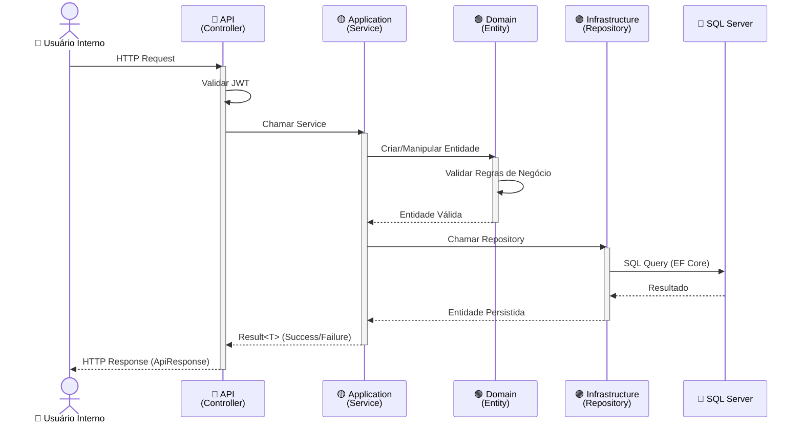
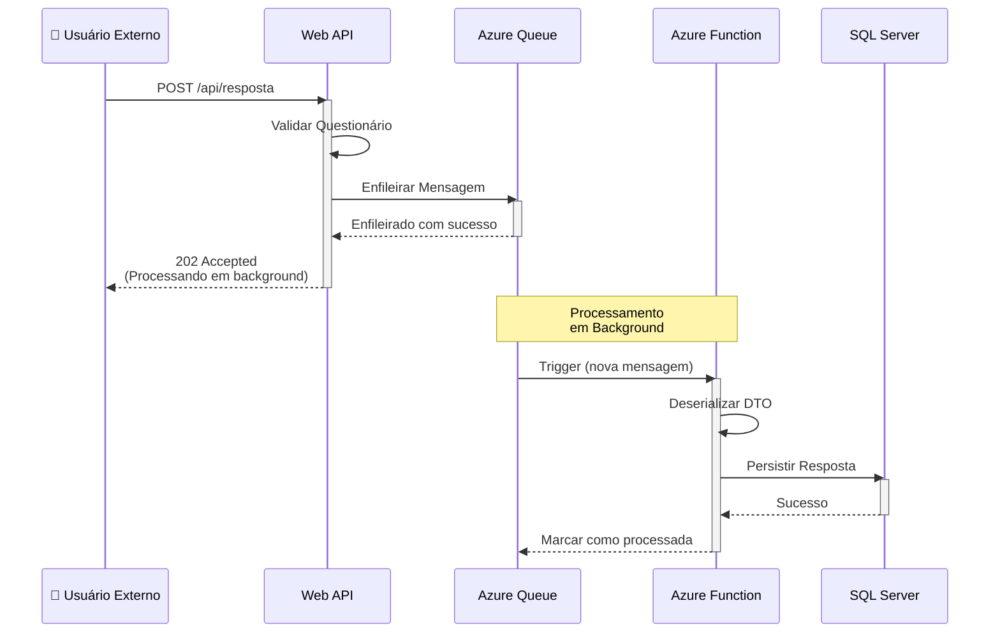
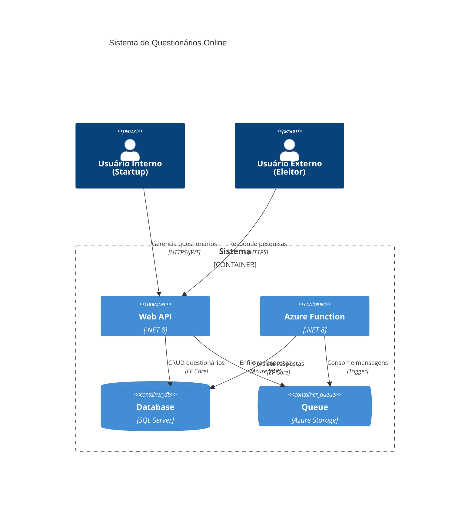
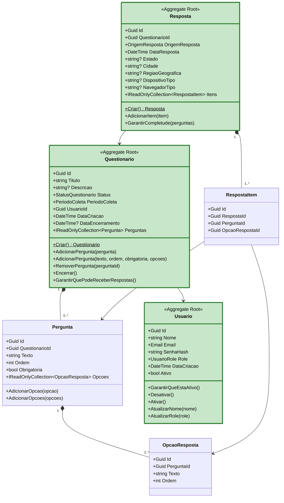

# 📋 Sistema de Questionários Online

[](https://dotnet.microsoft.com/)
[](https://docs.microsoft.com/en-us/dotnet/csharp/)
[](https://azure.microsoft.com/)
[](https://www.infnet.edu.br/)

> Projeto desenvolvido como Trabalho de Conclusão da **Pós-Graduação em Arquitetura de Software** do **Instituto Infnet**. Sistema empresarial para criação, gerenciamento e coleta de respostas de questionários com processamento assíncrono de alto volume usando Azure Queue Storage.

---

## 🎓 **Contexto Acadêmico**

Este projeto foi desenvolvido como **Trabalho de Conclusão da Pós-Graduação em Arquitetura de Software** do **Instituto Infnet**, sob a perspectiva de um **Arquiteto de Software** responsável por projetar uma solução escalável e de alta performance para uma startup.

### **Requisitos do Projeto Acadêmico**

**Cenário:**
Uma startup precisa de um sistema de questionários online para pesquisas públicas sobre eleições, com capacidade de receber respostas de **milhões de pessoas** simultaneamente através de campanhas em redes sociais.

**Restrições:**
- 👥 Time de **5 desenvolvedores** com conhecimento em **.NET e C#**
- 🔒 Obrigatoriedade de uso do **ecossistema .NET**
- ⏰ **Prazo crítico**: Eleições se aproximando (urgência de entrega)
- 📈 Escala: Suportar **milhões de respostas** simultâneas

---

## 🚀 **Instalação e Configuração**

### **Pré-requisitos**

- ✅ **.NET 8 SDK** - [Download](https://dotnet.microsoft.com/download/dotnet/8.0)
- ✅ **Docker Desktop** - [Download](https://www.docker.com/products/docker-desktop/)
- ✅ **Visual Studio 2022** ou **VS Code**
- ✅ **SQL Server LocalDB** (já incluído no Visual Studio)
---

### **📁 1. Clone o Repositório**

```bash
git clone https://github.com/LucasEsteves2/QuestionarioOnline_Ifnet.git
cd QuestionarioOnline
```

---

### **🐳 2. Iniciar RabbitMQ (Docker Compose)**

O projeto usa **RabbitMQ** como message broker para processamento assíncrono de respostas.

**Na raiz do projeto, execute:**

```powershell
docker-compose up -d
```

**O que acontece:**
- ✅ Baixa a imagem `rabbitmq:3.13-management-alpine` (primeira vez: ~2-5 min)
- ✅ Cria e inicia o container `questionario-rabbitmq`
- ✅ RabbitMQ fica pronto em ~15 segundos

**Verificar status:**

```powershell
docker ps | findstr rabbitmq
```

**URLs disponíveis:**
- **RabbitMQ Management UI**: http://localhost:15672
  - Usuário: `admin`
  - Senha: `admin123`
- **AMQP Protocol**: `amqp://localhost:5672`

---

### **💾 3. Configurar Banco de Dados (LocalDB)**

O projeto usa **SQL Server LocalDB** para desenvolvimento local (já vem com Visual Studio).

**Aplicar Migrations:**

```powershell
# Na raiz do projeto
dotnet ef database update --project QuestionarioOnline.Infrastructure --startup-project QuestionarioOnline
```

**Connection String (já configurada em `appsettings.json`):**

```json
{
  "ConnectionStrings": {
    "DefaultConnection": "Server=(localdb)\\mssqllocaldb;Database=QuestionarioOnlineDb;Trusted_Connection=True;MultipleActiveResultSets=true"
  }
}
```

---

### **🚀 4. Rodar a Aplicação**

1. Abra `QuestionarioOnline.sln`
2. Configure **Multiple Startup Projects**:
   - Botão direito na Solution → **"Set Startup Projects..."**
   - Escolha **"Multiple startup projects"**
   - Marque:
     - ✅ `QuestionarioOnline.Api` → **Start**
     - ✅ `QuestionarioOnline.Workers.Function` → **Start**
3. Pressione **F5**

**Resultado:**
- ✅ API inicia em: https://localhost:7001
- ✅ Workers (Azure Functions) iniciam automaticamente
- ✅ Swagger abre: https://localhost:7001/swagger

---
## ✨ **Funcionalidades e Endpoints**

### **Sistema de Permissões (Roles)**

O sistema implementa **controle de acesso baseado em papéis (RBAC)** com 3 níveis:

| Role | Permissões | Caso de Uso |
|------|-----------|-------------|
| **Analista** | Criar questionários, ver seus próprios resultados | Usuário padrão da startup |
| **Admin** | CRUD completo de questionários, ver TODOS os resultados | Gestor da startup |
| **Visualizador** | Ver resultados de TODOS os questionários (somente leitura) | Stakeholders, investidores |

**Regras de Negócio:**
- ✅ **Analista**: Apenas vê resultados dos questionários que ele **criou**
- ✅ **Admin**: Acesso total ao sistema (CRUD + resultados de todos)
- ✅ **Visualizador**: Vê resultados de qualquer questionário (somente leitura)
- ✅ **Role padrão**: Novos usuários são cadastrados como `Analista`

---

### **🔐 Autenticação**

| Método | Endpoint | Descrição | Autenticação |
|--------|----------|-----------|--------------|
| `POST` | `/api/auth/register` | Cadastrar novo usuário | ❌ Público |
| `POST` | `/api/auth/login` | Login com email/senha → Retorna JWT | ❌ Público |

---

### **📋 Questionários**

| Método | Endpoint | Descrição | Autenticação | Roles |
|--------|----------|-----------|--------------|-------|
| `POST` | `/api/questionario` | Criar questionário | ✅ JWT | **Admin** |
| `GET` | `/api/questionario` | Listar todos os questionários | ✅ JWT | Todos |
| `GET` | `/api/questionario/{id}` | Obter questionário por ID | ✅ JWT | Todos |
| `GET` | `/api/questionario/{id}/resultados` | Obter resultados (agregados) | ✅ JWT | Admin, Analista*, Visualizador |
| `PATCH` | `/api/questionario/{id}/encerrar` | Encerrar questionário | ✅ JWT | **Admin** |
| `DELETE` | `/api/questionario/{id}` | Deletar questionário | ✅ JWT | **Admin** |

**\*** Analista: Apenas resultados dos questionários que ele criou

---

### **💬 Respostas**

| Método | Endpoint | Descrição | Autenticação | Roles |
|--------|----------|-----------|--------------|-------|
| `POST` | `/api/resposta` | Registrar resposta (enfileira para processamento) | ✅ JWT | Todos |
| `GET` | `/api/resposta/questionario/{questionarioId}` | Listar respostas de um questionário | ✅ JWT | Admin, Visualizador |

---


## 🏗️ **Arquitetura**

### **Visão Geral da Solução**

A arquitetura do projeto foi estruturada seguindo os princípios de **Clean Architecture** combinada com **Domain-Driven Design (DDD)**, resultando em um **Monolito Modular** com **processamento assíncrono via fila de mensagens**.

```mermaid
graph TB
    subgraph "🔵 PRESENTATION LAYER"
        API[Web API<br/>Controllers, Middleware, JWT]
    end

    subgraph "🟡 APPLICATION LAYER"
        Services[Services<br/>Orquestração e Validação]
    end

    subgraph "🟢 DOMAIN LAYER"
        Entities[Entities<br/>Regras de Negócio]
    end

    subgraph "🟣 INFRASTRUCTURE LAYER"
        Repos[Repositories<br/>EF Core, Azure Queue]
    end

    subgraph "🔴 CROSS-CUTTING LAYER"
        DI[Dependency Injection<br/>Extensions, Constants]
    end

    subgraph "⚫ WORKERS LAYER"
        Functions[Azure Functions<br/>Background Processing]
    end

    API --> Services
    Services --> Entities
    Services --> Repos
    DI -.-> API
    DI -.-> Services
    DI -.-> Repos
    Functions --> Repos

    style Entities fill:#c8e6c9,stroke:#2e7d32,stroke-width:3px
    style Services fill:#fff9c4,stroke:#f57f17,stroke-width:2px
    style API fill:#e1f5ff,stroke:#01579b,stroke-width:2px
    style Repos fill:#d1c4e9,stroke:#4527a0,stroke-width:2px
    style DI fill:#ffccbc,stroke:#d84315,stroke-width:2px
    style Functions fill:#424242,stroke:#212121,stroke-width:2px
```



### **Camadas da Arquitetura**

#### **🔵 Presentation Layer (API)**
Camada de apresentação que expõe os endpoints REST para consumo externo.

**Responsabilidades:**
- Receber requisições HTTP e retornar respostas padronizadas
- Validar autenticação e autorização (JWT)
- Serializar/deserializar DTOs
- Documentar API via Swagger/OpenAPI
- Aplicar middleware (CORS, Exception Handling, Logging)

**Componentes:**
- `Controllers`: QuestionarioController, RespostaController, AuthController
- `Middlewares`: ExceptionMiddleware, AuthenticationMiddleware
- `Responses`: ApiResponse<T> (padronização)

**Princípio aplicado:** Dependency Rule - Depende apenas de Application Layer

---

#### **🟡 Application Layer**
Camada de aplicação que orquestra os casos de uso do sistema.

**Responsabilidades:**
- Implementar lógica de aplicação e casos de uso
- Coordenar chamadas entre Domain e Infrastructure
- Validar entrada de dados (FluentValidation)
- Transformar entre DTOs e entidades de domínio
- Gerenciar transações

**Componentes:**
- `Services`: QuestionarioService, RespostaService
- `DTOs`: Request/Response objects
- `Validators`: CriarQuestionarioValidator
- `Interfaces`: IQuestionarioService, IRespostaService

**Princípio aplicado:** Orquestração sem regras de negócio (essas ficam no Domain)

---

#### **🟢 Domain Layer (Core)**
Núcleo do sistema que contém as regras de negócio e modelos de domínio.

**Responsabilidades:**
- Definir entidades e aggregate roots
- Implementar regras de negócio complexas
- Garantir invariantes de domínio
- Definir value objects imutáveis
- Especificar interfaces de repositórios (contratos)

**Componentes:**
- `Entities`: Questionario ⭐, Resposta ⭐, Usuario ⭐
- `Value Objects`: Email, PeriodoColeta, OrigemResposta
- `Enums`: StatusQuestionario, UsuarioRole
- `Interfaces`: IQuestionarioRepository, IRespostaRepository

**Princípio aplicado:** Domain-Driven Design - Independente de frameworks externos

---

#### **🟣 Infrastructure Layer**
Camada de infraestrutura que implementa detalhes técnicos e acesso a recursos externos.

**Responsabilidades:**
- Implementar acesso a dados (EF Core)
- Configurar mapeamento objeto-relacional (FluentAPI)
- Gerenciar conexões com serviços externos (Azure Queue)
- Implementar repositórios concretos
- Aplicar otimizações de performance (índices, AsNoTracking)

**Componentes:**
- `DbContext`: QuestionarioOnlineDbContext
- `Repositories`: QuestionarioRepository, RespostaRepository
- `Configurations`: Mapeamento EF Core (14 configurações)
- `Messaging`: AzureQueueStorageAdapter

**Princípio aplicado:** Dependency Inversion - Implementa interfaces do Domain

---

#### **🔴 Cross-Cutting Layer**
Camada transversal que conecta todas as outras via Injeção de Dependência.

**Responsabilidades:**
- Configurar container de IoC (Dependency Injection)
- Registrar serviços e repositórios
- Configurar lifetime dos objetos (Scoped, Singleton, Transient)
- Centralizar configuração de infraestrutura

**Componentes:**
- `DependencyInjectionConfig`: Registro centralizado de dependências

**Princípio aplicado:** Inversão de Controle (IoC)

---

#### **⚫ Workers Layer**
Camada de processamento assíncrono em background.

**Responsabilidades:**
- Processar mensagens da fila (Azure Queue)
- Persistir respostas de questionários de forma assíncrona
- Implementar retry e dead letter queue
- Escalar automaticamente baseado no tamanho da fila

**Componentes:**
- `ProcessarRespostaFunction`: Azure Function com Queue Trigger

**Princípio aplicado:** Escalabilidade horizontal e desacoplamento via mensageria

---

### **Fluxo de Dados (Operações Síncronas)**

Para operações administrativas (criar questionários, consultar resultados, autenticação), o sistema opera de forma **síncrona** através das camadas da Clean Architecture:



**Características:**
- **Usado para**: Criar questionários, consultar resultados, autenticação
- **Latência**: ~50-100ms (aceitável para operações administrativas)
- **Garantias**: Transações ACID, feedback imediato, validação em tempo real

---

### **Fluxo de Dados (Operações Assíncronas)**

Para coleta massiva de respostas (alto volume), o sistema utiliza **processamento assíncrono** via fila de mensagens para garantir escalabilidade:



**Características:**
- **Usado para**: Receber respostas de pesquisas (10.000+ simultâneas)
- **Latência da API**: <5ms (usuário não espera processamento)
- **Processamento**: 100-500ms por resposta (em background)
- **Escalabilidade**: Azure Functions escalam automaticamente (0 a 1000 instâncias)


### **Visão C4 (Container)**

O diagrama C4 Model ilustra os containers e suas interações:



---

## 📐 **Domínio e Entidades**

O sistema foi modelado seguindo **Domain-Driven Design (DDD)**, com **3 Aggregate Roots** principais que encapsulam regras de negócio:



**⭐ Questionario (Aggregate Root)**
- **Responsabilidade**: Gerencia estrutura de pesquisas eleitorais

**⭐ Resposta (Aggregate Root)**
- **Responsabilidade**: Armazena respostas anônimas de eleitores

**⭐ Usuario (Aggregate Root)**
- **Responsabilidade**: Gerencia autenticação de analistas da startup
---

## 🎯 **Decisões Arquiteturais**

### **1. 🏢 Por que Monolito Modular (não Microservices)?**

**Contexto:**  
Startup com time de 5 desenvolvedores e prazo de 3 meses para entregar sistema funcional antes das eleições.

**Decisão:**  
Adotar **Monolito Modular** com **Clean Architecture**, mantendo fronteiras claras entre módulos (Questionario, Resposta, Auth) para facilitar futura extração como microservices.

**Justificativas:**

**✅ Pragmatismo:**
- **Prazo crítico**: Monolito = 3 meses de desenvolvimento | Microservices = 6+ meses
- **Setup simplificado**: 1 repositório, 1 pipeline CI/CD, 1 deploy
- **Debug facilitado**: Stack traces completos, sem rastreamento distribuído
- **Transações ACID**: Operações atômicas nativas (CREATE Questionario + Perguntas em 1 transação)

**✅ Time pequeno:**
- **5 desenvolvedores = 1 squad**: Todos trabalham no mesmo repositório
- **Conhecimento compartilhado**: Pull requests revisados por todos
- **Baixo overhead**: Sem necessidade de orquestração de múltiplos serviços

**⚠️ Trade-off aceito:**
- **Escala acoplada**: API, Questionario e Auth escalam juntos (mesma VM)
  - **Mitigação**: Processamento assíncrono via fila desacopla o pico de carga de respostas
- **Deploy all-or-nothing**: Mudança em Auth exige deploy completo
  - **Aceitável para MVP**: Entregas rápidas são mais importantes que deploy granular

**Caminho evolutivo:**
```
Fase 1 (Hoje - 3 meses):   Monolito Modular
Fase 2 (6-12 meses):        Worker separado (primeira extração)
Fase 3 (12-18 meses):       Microservices completo (se necessário)
```

---

### **2. ⚡ Por que Processamento Assíncrono (Fila + Azure Functions)?**

**Contexto:**  
Sistema precisa receber **10.000+ respostas simultâneas** durante campanhas virais em redes sociais (Instagram, Twitter, etc.). Processamento síncrono causaria timeout e perda de dados.

**Decisão:**  
Adotar **fila de mensagens (Azure Queue Storage)** + **Azure Functions** para processar respostas em background, retornando `202 Accepted` imediatamente para o usuário.

**Justificativas:**

**⚡ Performance crítica:**
- **API responde em <5ms**: Enfileira mensagem e retorna imediatamente
- **Sem timeout**: Processamento pode levar minutos sem afetar experiência
- **Latência previsível**: Independente de quantas respostas chegam, API sempre responde rápido

**Cenário real (post viral):**
```
10.000 respostas em 1 minuto:

❌ Processamento síncrono:
   10.000 × 500ms = 5.000 segundos (83 minutos)
   - Timeout após 30s
   - 98% das respostas perdidas

✅ Processamento assíncrono:
   10.000 × 5ms = 50 segundos
   - 100% de sucesso (202 Accepted)
   - Worker processa em 2 minutos (background)
```

**📈 Escalabilidade automática:**
- **Azure Functions escalam de 0 a 1000 instâncias** baseado no tamanho da fila
- **Custo otimizado**: Paga apenas pelo que usa (serverless pay-per-use)

**🛡️ Resiliência:**
- **Mensagens persistidas**: Se Worker crashar, mensagem volta para fila
- **Retry automático**: 5 tentativas com backoff exponencial
- **Dead Letter Queue (DLQ)**: Mensagens problemáticas vão para fila secundária

**❌ Por que não:**
- ❌ **Service Bus**: Custo 3x maior, features desnecessárias (tópicos, subscriptions)
- ❌ **HTTP síncrono**: Timeout, sem retry, perda de dados em falhas
- ❌ **RabbitMQ**: Exige gerenciar infraestrutura (VM, cluster, HA)

---

### **3. 💾 Por que SQL Server + EF Core (não NoSQL)?**

**Contexto:**  
Dados electorais exigem **integridade transacional** (ACID) e **queries analíticas complexas** (agregações por Estado, Cidade, Região).

**Decisão:**  
Usar **SQL Server** com **Entity Framework Core 8**, aplicando otimizações (AsNoTracking, índices, paginação).

**Justificativas:**

**✅ ACID crítico:**
- **Integridade transacional**: Criar Questionario + Perguntas + Opções em 1 transação atômica
- **Zero margem de erro**: Dados eleitorais não podem ser inconsistentes
- **Rollback automático**: Se falhar qualquer operação, reverte tudo

**✅ Expertise do time:**
- **5 devs já conhecem SQL Server**: Curva de aprendizado zero
- **Ferramentas maduras**: SSMS, Azure Data Studio, Application Insights

**⚡ Otimizações aplicadas:**
- **AsNoTracking** (+30% performance): Queries de leitura sem Change Tracker
- **14 índices estratégicos** (+40x buscas): QuestionarioId, Estado, Cidade
- **Paginação** (Skip/Take): Suporta 100k+ questionários sem memory overflow

**❌ Por que não NoSQL:**
- ❌ **MongoDB/Cosmos DB**: Eventual consistency = risco para dados eleitorais
- ❌ **Sem JOIN nativo**: Queries analíticas complexas exigem múltiplas chamadas

---

### **4. 🔐 Por que JWT Stateless (não Session-based)?**

**Contexto:**  
Sistema precisa escalar horizontalmente (múltiplas instâncias da API) sem compartilhar estado entre servidores.

**Decisão:**  
Usar **JWT Bearer** para autenticação stateless.

**Justificativas:**

**✅ Escalabilidade horizontal:**
- **Zero estado compartilhado**: Cada instância valida JWT independentemente
- **Sem Redis/Memcached**: Não precisa cache distribuído para sessions
- **Load Balancer simples**: Qualquer instância pode atender qualquer request

**✅ Performance:**
- **Sem consulta ao DB**: Token contém claims (usuarioId, email, roles)
- **Validação local**: Verifica assinatura HMAC-SHA256 (milissegundos)

**⚠️ Por que não Session-based:**
- ❌ Exige Redis/cache distribuído (complexidade)
- ❌ Estado compartilhado entre instâncias (acoplamento)

---

### **5. 🗳️ Por que NÃO vinculamos o eleitor que vota?**

**Contexto:**  
Sistema de pesquisas eleitorais públicas precisa garantir anonimato dos eleitores enquanto impede votos duplicados.

**Decisão:**  
**NÃO armazenar** identificação pessoal do eleitor. Usar **hash SHA256** (IP + UserAgent) para validar duplicatas sem identificar pessoas.

**Justificativas:**

**✅ Legalidade e Ética:**
- **Pesquisas eleitorais públicas devem ser anônimas** (legislação eleitoral)
- **LGPD/GDPR**: Armazenar dados pessoais exige consentimento e compliance
- **Liberdade de expressão**: Eleitor vota sem medo de retaliação

**✅ Escalabilidade:**
- **Sem autenticação**: Milhões de pessoas votam sem precisar criar conta
- **Performance**: Sem consultas a tabela de usuários (apenas validação de hash)
- **Simplicidade**: Endpoint público (`POST /api/resposta`) sem JWT

**✅ Segurança e Privacidade:**
- **Zero dados sensíveis**: Sem CPF, email, nome, telefone
- **Risco baixo de vazamento**: Apenas hash irreversível no banco
- **Confiança do público**: Anonimato garantido aumenta participação

**📊 Como Garantimos Integridade SEM Identificação?**

```csharp
// Value Object - OrigemResposta
public static OrigemResposta Create(string ipAddress, string userAgent)
{
    // Gera hash SHA256 irreversível (não armazena IP/UserAgent real)
    var combined = $"{ipAddress}|{userAgent}";
    var hash = ComputeHash(combined);  // Exemplo: "a3f5d8b2..."
    
    return new OrigemResposta(hash);
}

private static string ComputeHash(string input)
{
    var bytes = Encoding.UTF8.GetBytes(input);
    var hashBytes = SHA256.HashData(bytes);
    return Convert.ToHexString(hashBytes).ToLowerInvariant();
}
```

**O que o hash permite:**
- ✅ **Impedir voto duplicado**: Verifica se hash já existe no questionário
- ✅ **Análise demográfica**: Armazena Estado, Cidade, Região (dados agregados)
- ✅ **Detectar fraude em massa**: Muitas respostas do mesmo hash = suspeito
- ❌ **NÃO permite**: Identificar eleitor específico (hash é irreversível)

**Estrutura no Banco:**
```sql
CREATE TABLE Respostas (
    Id uniqueidentifier PRIMARY KEY,
    QuestionarioId uniqueidentifier NOT NULL,
    OrigemResposta_Hash nvarchar(64) NOT NULL,  -- SHA256 (anônimo!)
    Estado nvarchar(50),  -- Apenas dados demográficos
    Cidade nvarchar(100),
    DataResposta datetime2 NOT NULL
);

-- ❌ SEM: UsuarioId, CPF, Email, IP real, Nome
```

**Trade-off aceito:**
- ⚠️ **Limitação**: Eleitor do mesmo IP/navegador não pode votar 2x (mesmo questionário)
  - **Mitigação**: Aceitável para pesquisas eleitorais (1 voto por pessoa é o objetivo)
- ⚠️ **Fraude por VPN**: Eleitor pode mudar IP para votar múltiplas vezes
  - **Mitigação**: Dead Letter Queue + análise manual de padrões suspeitos

---

### **6. 🏗️ Por que Clean Architecture + DDD?**

**Contexto:**  
Time de 5 devs precisa trabalhar em paralelo sem conflitos, com código testável e preparado para evolução.

**Decisão:**  
Aplicar **Clean Architecture** (camadas isoladas) + **DDD** (Aggregate Roots, Value Objects).

**Justificativas:**

**✅ Manutenibilidade:**
- **Separação clara**: Cada dev trabalha em camada diferente
- **Baixo acoplamento**: Mudança em Infrastructure não afeta Domain
- **Código legível**: Regras de negócio isoladas em Domain

**✅ Testabilidade:**
- **Domain isolado**: Testes unitários sem mocks complexos
- **Interfaces**: Application depende de IRepository (mock fácil)

**✅ Evolução para Microservices:**
- **Fronteiras claras**: Cada módulo já está isolado
- **Comunicação via interfaces**: Fácil substituir por chamadas HTTP/gRPC


---

## 🛠️ **Tecnologias**

### **Backend**
- **.NET 8** - LTS até 2026
- **ASP.NET Core** - Web API
- **C# 12** - Records, pattern matching

### **Banco de Dados**
- **SQL Server / Azure SQL** - ACID + HA
- **Entity Framework Core 8** - ORM otimizado
- **FluentAPI** - Configuração explícita

### **Mensageria**
- **Azure Queue Storage** - Serverless, durável
- **Azure Functions** - Escala automática

### **Autenticação**
- **JWT Bearer** - Stateless
- **BCrypt.Net** - Hash de senhas

### **Validação**
- **FluentValidation** - Validação declarativa

### **Padrões**
- **Clean Architecture** (Uncle Bob)
- **Domain-Driven Design** (Eric Evans)
- **Repository Pattern**
- **Result Pattern** (Railway-Oriented)
- **Role-Based Access Control (RBAC)**

---


<div align="center">

**🎓 Projeto Acadêmico - Pós-Graduação Infnet 🎓**

[](https://www.infnet.edu.br/)
[](https://dotnet.microsoft.com/)
[](https://blog.cleancoder.com/uncle-bob/2012/08/13/the-clean-architecture.html)

</div>

---

