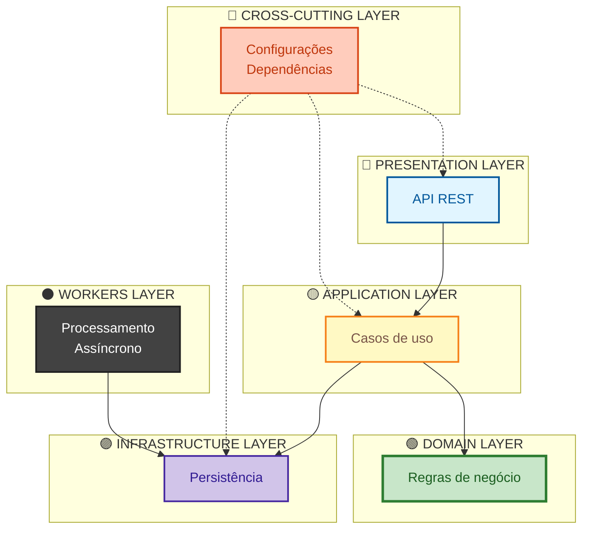
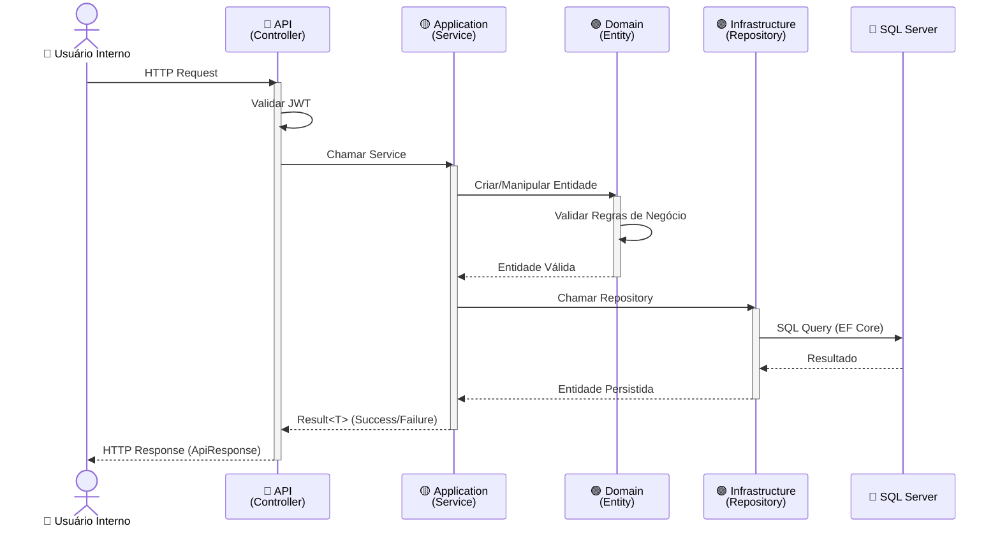
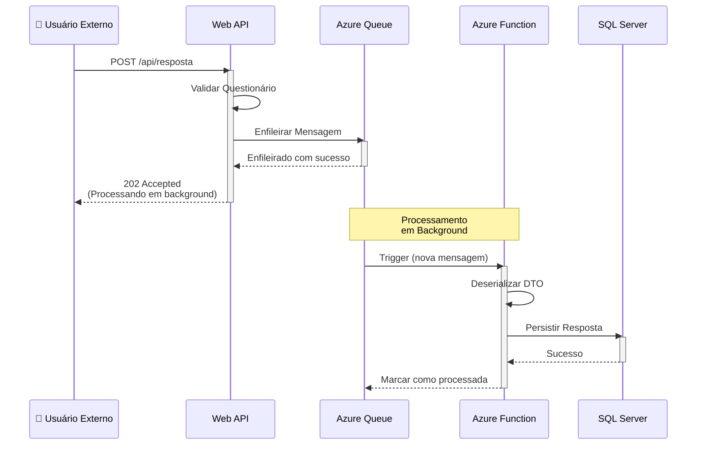
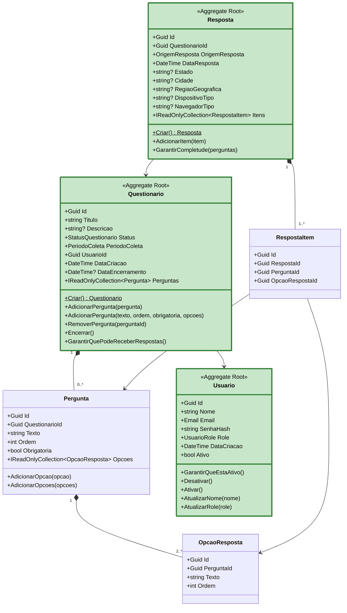

# 📋 Sistema de Questionários Online

[](https://dotnet.microsoft.com/)
[](https://docs.microsoft.com/en-us/dotnet/csharp/)
[](https://azure.microsoft.com/)
[](https://www.infnet.edu.br/)

## 🎓 **Contexto Acadêmico**

Este projeto foi desenvolvido como **Trabalho da Pós-Graduação em Arquitetura de Software** do **Instituto Infnet**, sob a perspectiva de um **Arquiteto de Software** responsável por projetar uma solução escalável e de alta performance para uma startup.

### **Requisitos do Projeto Acadêmico**

**Cenário:**
Uma startup precisa de um sistema de questionários online para pesquisas públicas sobre eleições, com capacidade de receber respostas de **milhões de pessoas** simultaneamente através de campanhas em redes sociais.

**Restrições:**
- 👥 Time de **5 desenvolvedores** com conhecimento em **.NET e C#**
- 🔒 Obrigatoriedade de uso do **ecossistema .NET**
- ⏰ **Prazo crítico**: Eleições se aproximando (urgência de entrega)
- 📈 Escala: Suportar **milhões de respostas** simultâneas

---

## 🚀 **Instalação e Configuração**

### **Pré-requisitos**

- ✅ **.NET 8 SDK** - [Download](https://dotnet.microsoft.com/download/dotnet/8.0)
- ✅ **Docker Desktop** - [Download](https://www.docker.com/products/docker-desktop/)
- ✅ **Visual Studio 2022** ou **VS Code**
- ✅ **SQL Server LocalDB** (já incluído no Visual Studio)
---

### **📁 1. Clone o Repositório**

```bash
git clone https://github.com/LucasEsteves2/QuestionarioOnline_Ifnet.git
cd QuestionarioOnline
```

---

### **🐳 2. Iniciar RabbitMQ (Docker Compose)**

O projeto usa **RabbitMQ** como message broker para processamento assíncrono de respostas.

**Na raiz do projeto, execute:**

```powershell
docker-compose up -d
```

**O que acontece:**
- ✅ Baixa a imagem `rabbitmq:3.13-management-alpine` (primeira vez: ~2-5 min)
- ✅ Cria e inicia o container `questionario-rabbitmq`
- ✅ RabbitMQ fica pronto em ~15 segundos

**Verificar status:**

```powershell
docker ps | findstr rabbitmq
```

**URLs disponíveis:**
- **RabbitMQ Management UI**: http://localhost:15672
  - Usuário: `admin`
  - Senha: `admin123`
- **AMQP Protocol**: `amqp://localhost:5672`

---

### **💾 3. Configurar Banco de Dados (LocalDB)**

O projeto usa **SQL Server LocalDB** para desenvolvimento local (já vem com Visual Studio).

**Connection String (já configurada em `appsettings.json`):**

```json
{
  "ConnectionStrings": {
    "DefaultConnection": "Server=(localdb)\\mssqllocaldb;Database=QuestionarioOnlineDb;Trusted_Connection=True;MultipleActiveResultSets=true"
  }
}
```

✅ **Migrations rodam automaticamente** na primeira execução!


---

### **🚀 4. Rodar a Aplicação**

1. Abra `QuestionarioOnline.sln`
2. Configure **Multiple Startup Projects**:
   - Botão direito na Solution → **"Set Startup Projects..."**
   - Escolha **"Multiple startup projects"**
   - Marque:
     - ✅ `QuestionarioOnline.Api` → **Start**
     - ✅ `QuestionarioOnline.Workers.Function` → **Start**
3. Pressione **F5**

**Resultado:**
- ✅ API inicia em: https://localhost:7001
- ✅ Workers (Azure Functions) iniciam automaticamente
- ✅ Swagger abre: https://localhost:7001/swagger


### 🌐 5. Clonar e Executar o Frontend (Opcional)

Caso queira utilizar a interface web do sistema, clone o projeto de frontend:

```bash
git clone <URL_DO_REPOSITORIO_FRONTEND>
cd <nome-do-projeto-frontend>
```


---
## ✨ **Funcionalidades e Endpoints**

### **Sistema de Permissões (Roles)**

O sistema implementa **controle de acesso baseado em papéis (RBAC)** com 3 níveis:

| Role | Permissões | Caso de Uso |
|------|-----------|-------------|
| **Analista** | Criar questionários, ver seus próprios resultados | Usuário padrão da startup |
| **Admin** | CRUD completo de questionários, ver TODOS os resultados | Gestor da startup |
| **Visualizador** | Ver resultados de TODOS os questionários (somente leitura) | Stakeholders, investidores |

**Regras de Negócio:**
- ✅ **Analista**: Apenas vê resultados dos questionários que ele **criou**
- ✅ **Admin**: Acesso total ao sistema (CRUD + resultados de todos)
- ✅ **Visualizador**: Vê resultados de qualquer questionário (somente leitura)
- ✅ **Role padrão**: Novos usuários são cadastrados como `Analista`

---

### **🔐 Autenticação**

| Método | Endpoint | Descrição | Autenticação |
|--------|----------|-----------|--------------|
| `POST` | `/api/auth/register` | Cadastrar novo usuário | ❌ Público |
| `POST` | `/api/auth/login` | Login com email/senha → Retorna JWT | ❌ Público |

---

### **📋 Questionários**

| Método | Endpoint | Descrição | Autenticação | Roles |
|--------|----------|-----------|--------------|-------|
| `POST` | `/api/questionario` | Criar questionário | ✅ JWT | **Admin** |
| `GET` | `/api/questionario` | Listar todos os questionários | ✅ JWT | Todos |
| `GET` | `/api/questionario/{id}` | Obter questionário por ID | ✅ JWT | Todos |
| `GET` | `/api/questionario/{id}/resultados` | Obter resultados (agregados) | ✅ JWT | Admin, Analista*, Visualizador |
| `PATCH` | `/api/questionario/{id}/encerrar` | Encerrar questionário | ✅ JWT | **Admin** |
| `DELETE` | `/api/questionario/{id}` | Deletar questionário | ✅ JWT | **Admin** |

**\*** Analista: Apenas resultados dos questionários que ele criou

---

### **💬 Respostas**

| Método | Endpoint | Descrição | Autenticação | Roles |
|--------|----------|-----------|--------------|-------|
| `POST` | `/api/resposta` | Registrar resposta (enfileira para processamento) | ✅ JWT | Todos |
| `GET` | `/api/resposta/questionario/{questionarioId}` | Listar respostas de um questionário | ✅ JWT | Admin, Visualizador |

---


## 🏗️ **Arquitetura**

### **Visão Geral da Solução**

A arquitetura do projeto foi estruturada seguindo os princípios de **Clean Architecture** combinada com **Domain-Driven Design (DDD)**, resultando em um **Monolito Modular** com **processamento assíncrono via fila de mensagens**.



### **Camadas da Arquitetura**

#### **🔵 Presentation Layer (API)**
Camada de apresentação que expõe os endpoints REST para consumo externo.

**Responsabilidades:**
- Receber requisições HTTP e retornar respostas padronizadas
- Validar autenticação e autorização (JWT)
- Serializar/deserializar DTOs
- Documentar API via Swagger/OpenAPI
- Aplicar middleware (CORS, Exception Handling, Logging)
---

#### **🟡 Application Layer**
Camada de aplicação que orquestra os casos de uso do sistema.

**Responsabilidades:**
- Implementar lógica de aplicação e casos de uso
- Coordenar chamadas entre Domain e Infrastructure
- Validar entrada de dados (FluentValidation)
- Transformar entre DTOs e entidades de domínio
- Gerenciar transações
---

#### **🟢 Domain Layer (Core)**
Núcleo do sistema que contém as regras de negócio e modelos de domínio.

**Responsabilidades:**
- Definir entidades e aggregate roots
- Implementar regras de negócio complexas
- Garantir invariantes de domínio
- Definir value objects imutáveis
- Especificar interfaces de repositórios (contratos)
---

#### **🟣 Infrastructure Layer**
Camada de infraestrutura que implementa detalhes técnicos e acesso a recursos externos.

**Responsabilidades:**
- Implementar acesso a dados (EF Core)
- Configurar mapeamento objeto-relacional (FluentAPI)
- Gerenciar conexões com serviços externos (Azure Queue)
- Implementar repositórios concretos
- Aplicar otimizações de performance (índices, AsNoTracking)

---

#### **🔴 Cross-Cutting Layer**
Camada transversal que conecta todas as outras via Injeção de Dependência.

**Responsabilidades:**
- Configurar container de IoC (Dependency Injection)
- Registrar serviços e repositórios
- Configurar lifetime dos objetos (Scoped, Singleton, Transient)
- Centralizar configuração de infraestrutura

---

#### **⚫ Workers Layer**
Camada de processamento assíncrono em background.

**Responsabilidades:**
- Processar mensagens da fila (Azure Queue)
- Persistir respostas de questionários de forma assíncrona
- Implementar retry e dead letter queue
- Escalar automaticamente baseado no tamanho da fila
---

### 🧱 Visão de Containers e Integrações


O diagrama abaixo apresenta a arquitetura do sistema em nível de containers, seguindo o C4 Model.


A comunicação do sistema é dividida entre operações **síncronas** (gestão e consultas) e **assíncronas** (coleta massiva de respostas), conforme detalhado nos fluxos abaixo.


---


### **Fluxo de Dados (Operações Síncronas)**

Para operações administrativas (criar questionários, consultar resultados, autenticação), o sistema opera de forma **síncrona** através das camadas da Clean Architecture:



**Características:**
- **Usado para**: Criar questionários, consultar resultados, autenticação
- **Latência**: ~50-100ms (aceitável para operações administrativas)
- **Garantias**: Transações ACID, feedback imediato, validação em tempo real

---

### **Fluxo de Dados (Operações Assíncronas)**

Para coleta massiva de respostas (alto volume), o sistema utiliza **processamento assíncrono** via fila de mensagens para garantir escalabilidade:



**Características:**
- **Usado para**: Receber respostas de pesquisas (10.000+ simultâneas)
- **Latência da API**: <5ms (usuário não espera processamento)
- **Processamento**: 100-500ms por resposta (em background)
- **Escalabilidade**: Azure Functions escalam automaticamente (0 a 1000 instâncias)
---


## 📐 **Domínio e Entidades**

O sistema foi modelado seguindo **Domain-Driven Design (DDD)**, com **3 Aggregate Roots** principais que encapsulam regras de negócio:



**⭐ Questionario (Aggregate Root)**
- **Responsabilidade**: Gerencia estrutura de pesquisas eleitorais

**⭐ Resposta (Aggregate Root)**
- **Responsabilidade**: Armazena respostas anônimas de eleitores

**⭐ Usuario (Aggregate Root)**
- **Responsabilidade**: Gerencia autenticação de analistas da startup
---

## 🎯 Decisões Arquiteturais

### 🏢 Monolito Modular (não Microservices)

**Decisão**  
Adotar **Monolito Modular** com **Clean Architecture**, mantendo módulos bem definidos e preparados para extração futura.

**Justificativa**
- Time pequeno (5 devs) e prazo curto (3 meses)
- Menor overhead operacional (1 repositório, 1 deploy)
- Debug simplificado e transações ACID nativas

**Trade-off aceito**  
Escala e deploy acoplados — aceitável para MVP.

**Evolução planejada**  
Monolito → Worker separado → Microservices (se necessário).

---

### ⚡ Processamento Assíncrono (Fila + Azure Functions)

**Decisão**  
Processar respostas via **Azure Queue Storage** + **Azure Functions**, retornando `202 Accepted`.

**Justificativa**
- Suporta picos de 10k+ respostas simultâneas
- Evita timeout e perda de dados
- Escalabilidade automática e custo sob demanda

**Benefícios**
Alta performance, resiliência (retry + DLQ) e desacoplamento.

---

### 💾 SQL Server + EF Core (não NoSQL)

**Decisão**  
Usar **SQL Server** com **EF Core**, aplicando índices, paginação e `AsNoTracking`.

**Justificativa**
- Integridade transacional (ACID)
- Queries analíticas complexas (JOIN, agregações)
- Expertise do time e ferramentas maduras

**Trade-off**
Menor flexibilidade de schema — aceitável para dados eleitorais.

---

### 🔐 Autenticação JWT Stateless

**Decisão**  
Usar **JWT Bearer** stateless.

**Justificativa**
- Escalabilidade horizontal sem estado compartilhado
- Sem necessidade de Redis ou session store
- Validação rápida e local do token

---

### 🗳️ Voto Anônimo (sem identificação do eleitor)

**Decisão**  
Não armazenar identificação do eleitor. O sistema não possui conceito de usuário para quem responde pesquisas públicas.

**Justificativa**
- Alto volume de acessos (milhares/milhões de respostas)
- Criar usuários tornaria o sistema inviável em escala
- Autenticação adicionaria latência, custo e complexidade desnecessária
- Nenhum ganho funcional em identificar o eleitor

**Abordagem adotada**
- Endpoint público (`POST /api/respostas`)
- Hash SHA256 (IP + UserAgent) apenas para evitar votos duplicados
- Armazenamento apenas de dados agregados (Estado, Cidade, Região)

**Resultado**
- Alta escalabilidade
- Baixa latência
- Zero dados sensíveis armazenados
- Sistema simples, rápido e seguro

### 🏗️ Clean Architecture + DDD

**Decisão**  
Aplicar **Clean Architecture** para isolamento de camadas e **DDD** para regras de negócio.

**Justificativa**
- Código testável e de fácil manutenção
- Baixo acoplamento entre camadas
- Base sólida para evolução futura

---


## 🛠️ Tecnologias

| Categoria        | Tecnologia                     | Descrição |
|------------------|--------------------------------|-----------|
| **Backend**      | .NET 8                         | LTS até 2026 |
|                  | ASP.NET Core                   | Web API |
|                  | C# 12                          | Records, pattern matching |
| **Banco de Dados** | SQL Server / Azure SQL        | ACID, alta disponibilidade |
|                  | Entity Framework Core 8        | ORM otimizado |
|                  | Fluent API                     | Mapeamento explícito |
| **Mensageria**   | Azure Queue Storage            | Serverless e durável |
|                  | Azure Functions                | Escala automática |
| **Autenticação** | JWT Bearer                     | Stateless |
|                  | BCrypt.Net                     | Hash de senhas |
| **Validação**    | FluentValidation               | Validação declarativa |
| **Padrões**      | Clean Architecture             | Separação de camadas |
|                  | Domain-Driven Design (DDD)     | Modelagem de domínio |
|                  | Repository Pattern             | Abstração de persistência |
|                  | Result Pattern                 | Fluxo orientado a sucesso/erro |
|                  | RBAC                           | Controle por papéis |


---


<div align="center">

**🎓 Projeto Acadêmico - Pós-Graduação Infnet 🎓**

[](https://www.infnet.edu.br/)
[](https://dotnet.microsoft.com/)
[](https://blog.cleancoder.com/uncle-bob/2012/08/13/the-clean-architecture.html)

</div>

---

